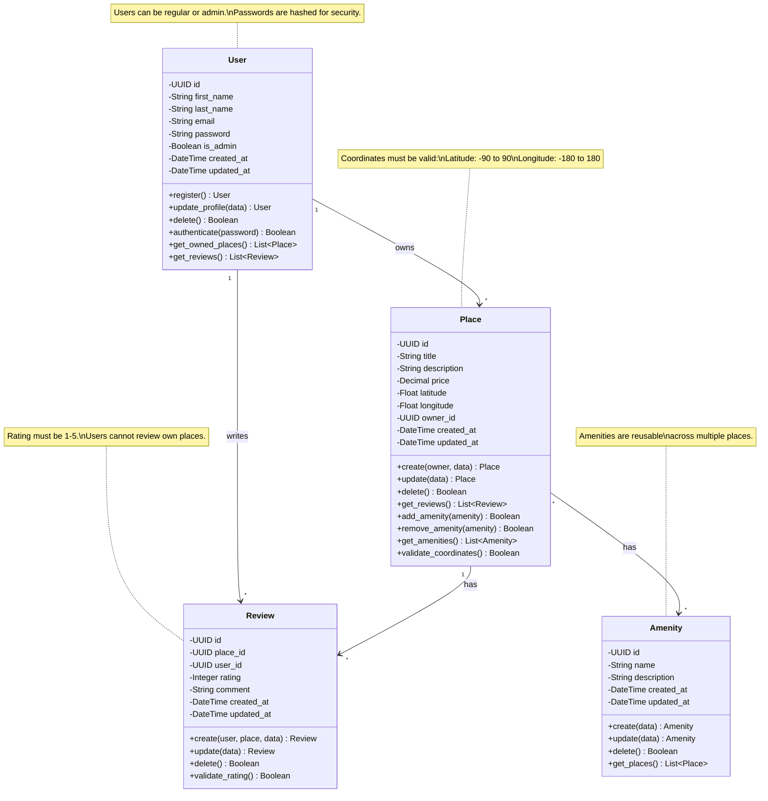

# Task 1: Detailed Class Diagram for Business Logic Layer

## Complete Entity Relationship Diagram

## Detailed Entity Specifications

### User Entity

**Purpose**: Manages user accounts, authentication, and authorization

**Attributes**:
- `id` (UUID): Unique identifier, primary key
- `first_name` (String): User's first name, required, max 50 characters
- `last_name` (String): User's last name, required, max 50 characters
- `email` (String): Unique email address, required, must be valid format
- `password` (String): Hashed password, required, minimum 8 characters
- `is_admin` (Boolean): Admin flag, default False
- `created_at` (DateTime): Account creation timestamp, auto-generated
- `updated_at` (DateTime): Last update timestamp, auto-updated

**Methods**:
- `register()`: Creates new user with validation
  - Validates email format and uniqueness
  - Hashes password using bcrypt
  - Sets creation timestamp
  - Returns User object or raises ValidationError

- `update_profile(data)`: Updates user information
  - Validates new data
  - Updates modified fields
  - Updates updated_at timestamp
  - Returns updated User object

- `delete()`: Soft deletes user account
  - Marks account as inactive
  - Preserves data for audit
  - Returns success boolean

- `authenticate(password)`: Verifies password
  - Compares hashed password
  - Returns boolean

- `get_owned_places()`: Retrieves user's places
  - Returns list of Place objects
  - Ordered by created_at descending

- `get_reviews()`: Retrieves user's reviews
  - Returns list of Review objects
  - Ordered by created_at descending

**Business Rules**:
- Email must be unique across all users
- Password must be at least 8 characters
- Cannot delete user with active bookings (future feature)
- Admin users have elevated permissions

---

### Place Entity

**Purpose**: Represents properties listed for rent

**Attributes**:
- `id` (UUID): Unique identifier, primary key
- `title` (String): Property title, required, max 100 characters
- `description` (String): Detailed description, required, max 1000 characters
- `price` (Decimal): Price per night, required, must be positive
- `latitude` (Float): Geographic latitude, required, range: -90 to 90
- `longitude` (Float): Geographic longitude, required, range: -180 to 180
- `owner_id` (UUID): Foreign key to User, required
- `created_at` (DateTime): Creation timestamp, auto-generated
- `updated_at` (DateTime): Last update timestamp, auto-updated

**Methods**:
- `create(owner, data)`: Creates new place listing
  - Validates all required fields
  - Checks owner exists
  - Validates coordinates
  - Returns Place object

- `update(data)`: Updates place information
  - Validates modified fields
  - Only owner or admin can update
  - Updates updated_at timestamp
  - Returns updated Place object

- `delete()`: Removes place listing
  - Only owner or admin can delete
  - Cascades to reviews (soft delete)
  - Returns success boolean

- `get_reviews()`: Retrieves all reviews
  - Returns list of Review objects
  - Includes user information
  - Ordered by created_at descending

- `add_amenity(amenity)`: Associates amenity
  - Creates Place-Amenity relationship
  - Prevents duplicates
  - Returns success boolean

- `remove_amenity(amenity)`: Removes amenity
  - Deletes Place-Amenity relationship
  - Returns success boolean

- `get_amenities()`: Retrieves associated amenities
  - Returns list of Amenity objects
  - Ordered by name

- `validate_coordinates()`: Validates lat/lng
  - Checks latitude range: -90 to 90
  - Checks longitude range: -180 to 180
  - Returns boolean

**Business Rules**:
- Price must be positive (> 0)
- Coordinates must be valid geographic coordinates
- Title and description are required
- Only owner or admin can modify
- Cannot delete place with active bookings (future)

---

### Review Entity

**Purpose**: Stores user feedback and ratings for places

**Attributes**:
- `id` (UUID): Unique identifier, primary key
- `place_id` (UUID): Foreign key to Place, required
- `user_id` (UUID): Foreign key to User, required
- `rating` (Integer): Rating value 1-5, required
- `comment` (String): Review text, optional, max 500 characters
- `created_at` (DateTime): Creation timestamp, auto-generated
- `updated_at` (DateTime): Last update timestamp, auto-updated

**Methods**:
- `create(user, place, data)`: Creates new review
  - Validates user is not place owner
  - Validates rating is 1-5
  - Checks for existing review (one per user per place)
  - Returns Review object

- `update(data)`: Updates review content
  - Only review author can update
  - Validates rating if changed
  - Updates updated_at timestamp
  - Returns updated Review object

- `delete()`: Removes review
  - Only author or admin can delete
  - Returns success boolean

- `validate_rating()`: Validates rating value
  - Checks rating is integer
  - Checks range 1-5
  - Returns boolean

**Business Rules**:
- User cannot review their own place
- Rating must be between 1 and 5 (inclusive)
- One review per user per place
- Comment is optional but recommended
- Only author or admin can modify/delete

**Constraints**:
- Unique constraint on (user_id, place_id)
- Foreign key constraints maintained
- Check constraint on rating (1-5)

---

### Amenity Entity

**Purpose**: Defines features and facilities available at places

**Attributes**:
- `id` (UUID): Unique identifier, primary key
- `name` (String): Amenity name, required, unique, max 50 characters
- `description` (String): Detailed description, optional, max 200 characters
- `created_at` (DateTime): Creation timestamp, auto-generated
- `updated_at` (DateTime): Last update timestamp, auto-updated

**Methods**:
- `create(data)`: Creates new amenity
  - Validates name is unique
  - Validates name length
  - Returns Amenity object

- `update(data)`: Updates amenity information
  - Only admin can update
  - Validates name uniqueness if changed
  - Updates updated_at timestamp
  - Returns updated Amenity object

- `delete()`: Removes amenity
  - Only admin can delete
  - Checks if amenity is in use
  - May require cascade or prevent deletion
  - Returns success boolean

- `get_places()`: Retrieves places with this amenity
  - Returns list of Place objects
  - Ordered by title

**Business Rules**:
- Name must be unique
- Only admins can create/update/delete amenities
- Cannot delete if associated with places (configurable)
- Common amenities: WiFi, Pool, Parking, Kitchen, etc.

**Examples of Amenities**:
- WiFi
- Swimming Pool
- Parking
- Air Conditioning
- Kitchen
- Washing Machine
- TV
- Gym
- Pet Friendly

---

## Relationships

### User → Place (One-to-Many)
- **Cardinality**: One User owns zero or many Places
- **Implementation**: `owner_id` foreign key in Place table
- **Cascade**: Deleting User may cascade to Places (configurable)
- **Business Rule**: Owner has full control over their places

### User → Review (One-to-Many)
- **Cardinality**: One User writes zero or many Reviews
- **Implementation**: `user_id` foreign key in Review table
- **Cascade**: Deleting User may cascade to Reviews
- **Business Rule**: User can review multiple places

### Place → Review (One-to-Many)
- **Cardinality**: One Place has zero or many Reviews
- **Implementation**: `place_id` foreign key in Review table
- **Cascade**: Deleting Place cascades to Reviews
- **Business Rule**: Each place can accumulate reviews over time

### Place ↔ Amenity (Many-to-Many)
- **Cardinality**: Many Places have many Amenities
- **Implementation**: Junction table `place_amenity` with:
  - `place_id` (UUID, FK to Place)
  - `amenity_id` (UUID, FK to Amenity)
  - Composite primary key on (place_id, amenity_id)
- **Cascade**: Deleting Place removes associations, Amenity preserved
- **Business Rule**: Amenities are reusable across multiple places

---

## Database Schema Considerations

### Indexes
- Primary keys: Automatic B-tree indexes on all `id` fields
- Foreign keys: Indexes on `owner_id`, `user_id`, `place_id`, `amenity_id`
- Unique constraints: Index on `users.email`, `amenities.name`
- Search optimization: Index on `places.title`, `places.price`

### Constraints
- **NOT NULL**: All required fields
- **UNIQUE**: `users.email`, `amenities.name`
- **CHECK**: `reviews.rating BETWEEN 1 AND 5`
- **CHECK**: `places.price > 0`
- **FOREIGN KEY**: All relationship fields with CASCADE options

### Timestamps
- All entities have `created_at` and `updated_at`
- `created_at`: Set once on creation, never modified
- `updated_at`: Automatically updated on any modification
- Used for audit trails and debugging

---

## File Information

**Task**: Task 1 - Detailed Class Diagram for Business Logic Layer  
**Deliverable**: Complete entity specifications with relationships  
**Format**: Mermaid class diagram  
**Location**: `holbertonschool-hbnb/part1/`
